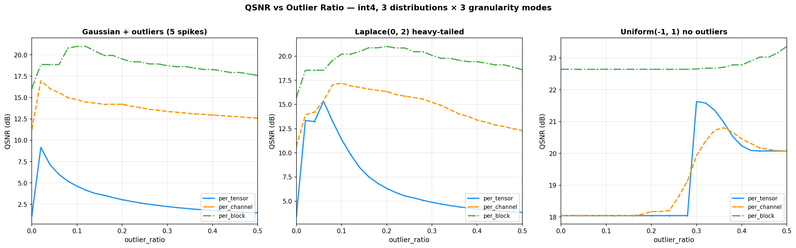

# Sparse Outlier 隔离

量化中一个离群点就能毁掉整个组的精度。Sparse outlier 隔离将 top-k 离群点拆分到独立 scale 组，阻止它们碾压正常值。

> 运行分析脚本（含本文所有数据）：
> ```bash
> PYTHONPATH=. python scripts/sparse_analysis.py
> ```
> 输出图：`scripts/output_sparse_analysis/qsnr_vs_ratio.png`

## 1. 问题：一个离群点如何破坏量化

以 int4（等级 ±{0, 0.25, 0.5, 0.75, 1.0, 1.25, 1.5, 1.75}）量化 4×8 tensor 为例：

```
x = [[ 0.5, -0.3,  0.8, -0.2,  1.2, -0.7,  0.1, 15.0 ],   ← row 0 有 outlier 15.0
     [ 0.4,  0.9, -1.1,  0.3, -0.5,  0.6, -0.9,  0.2 ],
     [-0.8,  0.2, -0.4,  0.7, -0.1,  8.0,  0.3, -0.6 ],   ← row 2 有 outlier 8.0
     [ 0.1, -0.2,  0.5, -0.8,  0.4, -0.3,  0.9, -1.5 ]]
```

正常值在 [-1.5, 1.2] 范围，但两个 outlier（15.0 和 8.0）存在。

### Per-tensor 量化（无 sparse）

全 tensor 共享一个 amax。`pot(15.0) = 16.0`，所有 32 个元素归一化到 X/16.0。15.0 映射到 1.0 可以表示，但 1.2/16=0.075 四舍五入为 0——**30/32 个值被 crush 为零**。

```
amax = pot(max|X|) = 16.0
QSNR = 13.42 dB
```

### Per-channel 量化（无 sparse）

每行独立 amax。Row 0 和 Row 2 被各自的 outlier 主导（amax 分别为 16.0 和 8.0），但 Row 1 和 Row 3 无 outlier 影响，正常量化。**16/32 个值被 crush**，QSNR 改善到 17.05 dB。

### Per-block 量化（无 sparse，block_size=4, axis=-1）

每 4 列一个 block。Outlier 只影响所在 block（2/8 blocks），其他 6 个 block 正常。QSNR = 20.51 dB。更细粒度的 scale 分担天然隔离了 outlier——这就是 fine-grained quantization 的核心思路，但代价是 scale buffer 开销。

| 模式 | QSNR (dB) | 被 crush 值 |
|------|----------|------------|
| per_tensor | 13.42 | 30/32 |
| per_channel | 17.05 | 16/32 |
| per_block | 20.51 | 5/32 |

## 2. Sparse 机制

在现有 granularity group 内再分裂 scale——将 top-k 离群点隔离到独立 scale 组。**不改变 group 边界，只增加 scale 数量。**

```
per_tensor:  1 amax → 2 amax (outlier 组 + normal 组)
per_channel: C amax → 2C amax
per_block:   B amax → 2B amax
```

`outlier_ratio` ∈ [0,1] 控制离群点比例。k = max(1, int(N × ratio))，当 k ≥ N 时退化为普通量化。

### 用法

```python
from src.session import QuantConfig

# per_tensor + sparse
cfg = QuantConfig(w_format="int4", outlier_ratio=0.05)

# per_channel + sparse
cfg = QuantConfig(w_format="int4", w_granularity="per_channel",
                  outlier_ratio=0.02)

# per_block + sparse（MX 风格）
cfg = QuantConfig(w_format="fp4_e2m1", w_granularity="per_block",
                  w_block_size=32, outlier_ratio=0.05)
```

> 当前仅支持动态路径（scale=None）。静态 scale 路径（calibration 预存）留待后续。Float formats（ebits>0）不适用 sparse——自带指数动态范围，直接 delegate 至非 sparse 路径。

### Per-tensor sparse 逐步推演（ratio=0.1）

```
N=32, k = max(1, int(32 × 0.1)) = 3
Top-3 by magnitude: 15.0 (idx 7), 8.0 (idx 21), -1.5 (idx 31)

Outlier 组: {15.0, 8.0, -1.5}        → amax_o = pot(15.0) = 16.0
Normal 组:  everything else (29 个)  → amax_n = pot(1.2)   = 1.0
```

Normal 组的 amax 从 16.0 降到 1.0——缩小 16 倍。每个元素量化到 int4 等级，等价于用更精细的标尺重新标注所有非 outlier 值。

| 元素 | 原始值 | 无 sparse | sparse(0.1) | 改善 |
|------|--------|----------|------------|------|
| x[0,0] | 0.5 | 0.0 (crushed) | 0.5 | ✓ 精确恢复 |
| x[0,4] | 1.2 | 0.0 (crushed) | 1.25 | ✓ 误差 0.05 |
| x[0,7] | 15.0 | 16.0 (饱和) | 16.0 (饱和) | — 同属 outlier 组 |
| x[3,7] | -1.5 | 0.0 (crushed) | 0.0 (crushed) | — 被 outlier 组 amax=16 碾压 |

**边界效应**：第三个 outlier -1.5 被归入 outlier 组后反而被 amax_o=16.0 碾压。在 normal 组中本可被 amax_n=1.0 完美保留（-1.5/1.0 → int4 level -1.5）。这是 top-k 方法的固有 tradeoff：**ratio 过大时，"假离群点"被错误归入 outlier 组而受害**。ratio 需校准到真实 outlier 比例，不能盲目加大。

QSNR: 13.42 → **19.48 dB** (Δ=+6.06 dB)

### Per-channel sparse 逐步推演（ratio=0.1, axis=0）

```
C=4 channels, N_per_channel=8, k = max(1, int(8 × 0.1)) = 1
```

每 channel 独立选 top-1：

| Channel | Outlier | amax_base | amax_o | amax_n | shrink |
|---------|---------|-----------|--------|--------|--------|
| 0 | 15.0 | 16.0 | 16.0 | **1.0** | 16× |
| 1 | -1.1 | 1.0 | 1.0 | **1.0** | 1× |
| 2 | 8.0 | 8.0 | 8.0 | **1.0** | 8× |
| 3 | -1.5 | 2.0 | 2.0 | **1.0** | 2× |

Channel 1 的 outlier -1.1 和正常组最大值的 pot amax 相同（都是 1.0），sparse 无效果——此为预期行为，说明该 channel 不需要 sparse。

QSNR: 17.05 → **24.17 dB** (Δ=+7.12 dB)

### Per-block sparse 逐步推演（ratio=0.1, size=4）

```
block_size=4, k = max(1, int(4 × 0.1)) = 1
```

每 block 独立 top-1。Block(row0, cols4-7)={1.2, -0.7, 0.1, 15.0} 中，15.0 是 outlier，正常值 1.2 的 shared_exp 从 3（归一化到 8）降到 0（归一化到 1），量化后的值从 2.0（误差 0.8）改善到 1.25（误差 0.05）。

QSNR: 20.51 → **24.54 dB** (Δ=+4.02 dB)

### 三种模式 sparse 对比

| 模式 | QSNR base | QSNR sparse | Δ |
|------|----------|------------|---|
| per_tensor | 13.42 | 19.48 | +6.06 |
| per_channel | 17.05 | 24.17 | **+7.12** |
| per_block | 20.51 | 24.54 | +4.02 |

Per_channel 受益最大——outlier 隔离 + 逐 channel 精细 scale 形成组合优势。Per_block 绝对收益最小，因为 block 级 scale 本身已有一定 outlier 隔离能力。

## 3. QSNR vs Ratio 曲线

在 64×128 tensor 上，对 3 种分布的 int4 量化，扫描 outlier_ratio ∈ [0, 0.5]：



### 解读

**Gaussian + 5 个离群点（±15）**：
- Per_tensor 基线仅 1.18 dB——5 个离群点几乎摧毁所有量化精度
- ratio=0.02 即达峰值 9.16 dB（Δ=+7.98 dB），之后边际递减
- Per_channel 和 per_block 基线已较好，sparse 仍带来 4-5 dB 增益

**Laplace(0, 2)（重尾分布）**：
- Per_tensor 基线 3.50 dB，最佳 ratio=0.06 达 15.35 dB（Δ=+11.85 dB）
- 重尾分布需要更大 ratio：per_channel 最佳 ratio=0.10，per_block 最佳 ratio=0.20
- 自然重尾下，"中度 outlier" 更多，需要更多离群点 slot

**Uniform(-1, 1)（无 outlier）**：
- Per_tensor 基线 18.05 dB，ratio=0.30 达 21.63 dB（Δ=+3.59 dB）
- 即使没有 outlier，scale 分裂本身也能提升量化精度（将值域拆分为两段，每段用更适配的 scale）
- Per_block 几乎无提升（+0.72 dB）——block 内分布已足够均匀

### 关键规律

1. **有极端 outlier → 小 ratio（0.02-0.05）即可**。超过真实 outlier 比例后，"假离群点"被误分入 outlier 组，收益递减
2. **重尾分布 → 需要更大 ratio（0.06-0.20）**。多个"中度 outlier"需要更多 slot
3. **均匀分布 → ratio ≈ 0.3 仍有边际收益**，但绝对值有限
4. **越粗的粒度，sparse 收益越大**（per_tensor > per_channel > per_block）

## 4. 与 Transform 的关系

Sparse 和 Hadamard / SmoothQuant 都是解决 outlier 问题的工具，机制互补：

| 方法 | 机制 | 效果 | 代价 |
|------|------|------|------|
| **Sparse** | 拆分 outlier 到独立 scale | 直接，不改变数值 | 2× scale 存储 |
| **Hadamard** | 正交旋转均匀化分布 | 减少 outlier，提升所有粒度 | O(n log n) 旋转开销 |
| **SmoothQuant** | 激活 scale 迁移到权重 | 针对 matmul 输入 outlier | 改变权重值 |

Hadamard 旋转后分布更均匀 → outlier 减少 → sparse 边际收益降低。两种方法可以组合，但通常 Hadamard 先执行、sparse 后做，因为 Hadamard 改变了"谁是 outlier"的分布。

## 5. 使用建议

| 场景 | 推荐 ratio | 理由 |
|------|-----------|------|
| 已知有极端离群点（LLM 激活） | 0.02–0.05 | 真实 outlier 比例极小 |
| 重尾分布（Laplace-like） | 0.05–0.15 | 需要更多 slots |
| 不确定分布特征 | 0.05 | 安全默认值 |
| 已使用 Hadamard/SmoothQuant | 0.02 或 0 | 分布已均匀化，sparse 收益降低 |
| per_block (MX) 格式 | 0.02–0.05 | block 级已有隔离，少量 outlier 再隔离即可 |

代价：scale buffer 数量翻倍。对 per_tensor（1→2）可忽略；对 per_channel（C→2C）轻量；对 per_block（B→2B）需考虑 block 数较多时的内存开销。

> 设计决策详见 [ADR-011: Sparse 泛化](../architecture/011-sparse-generalization.md)。
> 数学推导详见 [018-sparse-per-tensor](../verification/018-sparse-per-tensor.md) 和 [019-sparse-per-channel](../verification/019-sparse-per-channel.md)。
